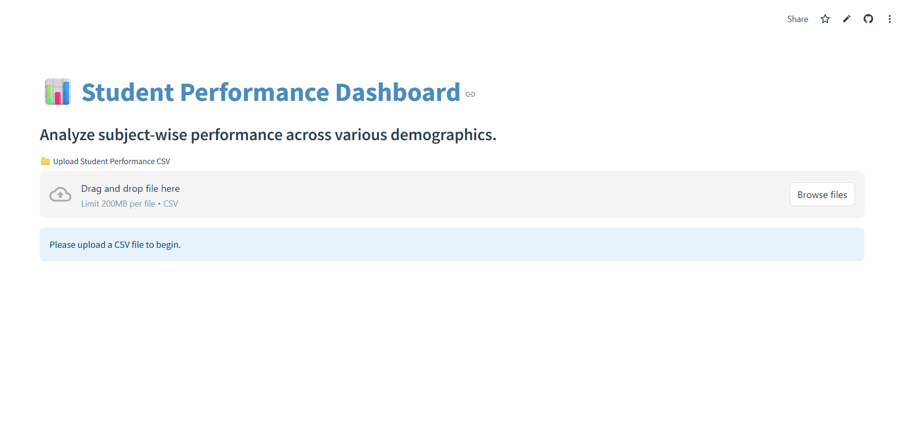
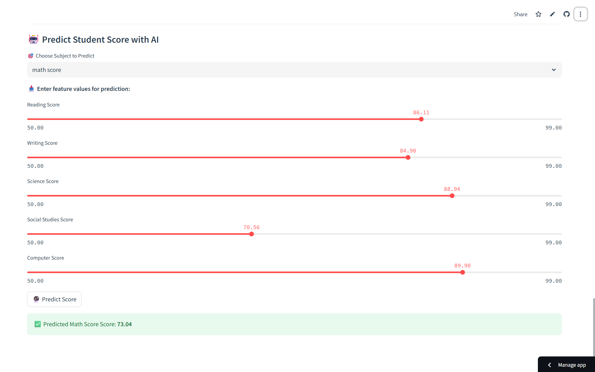
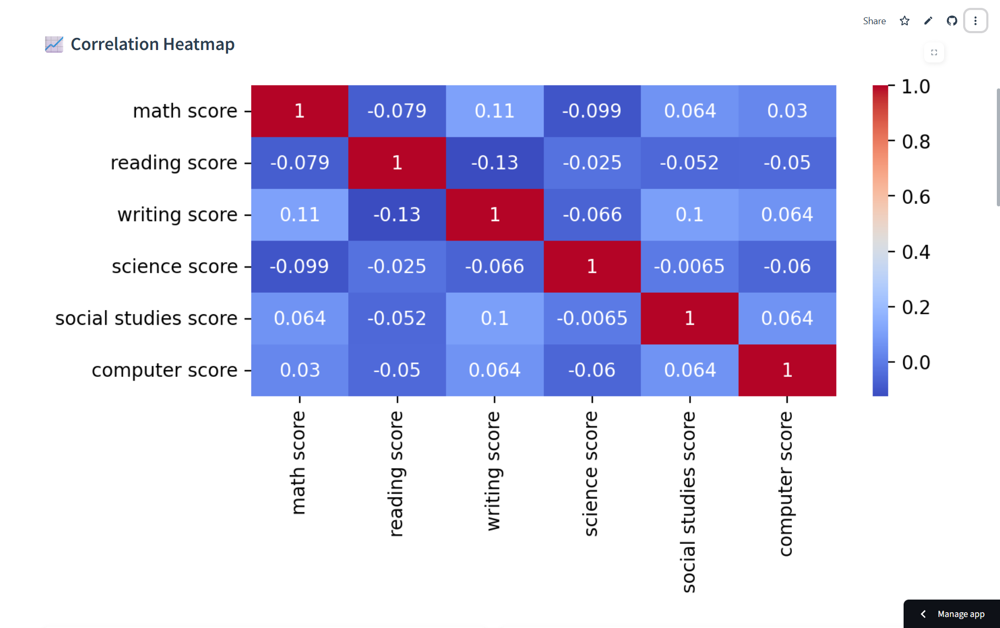
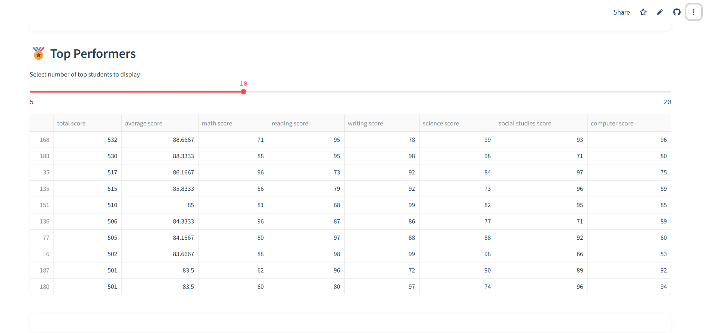

<h1 align="center">📊 Student Performance Analyzer</h1>

<p align="center">
  An interactive <strong>Streamlit AI dashboard</strong> to visualize and predict student performance.<br>
  Built with Python, Pandas, Plotly, Seaborn, and scikit-learn.
</p>

<p align="center">
  
  
  
</p>

---

## ✨ Features

- 📁 Upload student performance CSV files
- 📊 Visualize subject-wise score distributions & correlations
- 📈 Compare scores across gender/class/other categories
- 🤖 Predict student scores using **AI-powered regression**
- 🏅 Highlight top performers with total & average score calculations
- 🎨 Beautiful UI with modern layout, color, and interaction

---

## 🚀 Live Demo

> 🔗 **[Click here to try it online (if deployed)](https://student-analyzer.streamlit.app)**  
> *(or run locally using instructions below)*

---

## 📂 Example CSV Format

```csv
Name, Roll No, Math, Science, Computer, Gender
John Doe, 101, 78, 82, 85, Male
Jane Smith, 102, 92, 88, 91, Female
````

✅ At least two numeric subject columns required
🚫 Avoid IDs being mistaken for scores — e.g., `Roll No`, `Admission No`

---

## 🧑‍💻 Run Locally

### 🔧 Installation

```bash
git clone https://github.com/CH-Anonymous/student-performance-analyzer.git
cd student-performance-analyzer
pip install -r requirements.txt
```

### ▶ Launch App

```bash
streamlit run app.py
```

Then visit: [http://localhost:8501](http://localhost:8501)

---

## 🤖 AI Integration

* Built-in **Linear Regression model**
* Predicts any subject based on other subject scores
* Real-time prediction from user input sliders
* No need to train or upload models — it trains on your CSV!

---

## 🛠 Built With

* [Streamlit](https://streamlit.io)
* [Pandas](https://pandas.pydata.org/)
* [scikit-learn](https://scikit-learn.org/)
* [Plotly](https://plotly.com/python/)
* [Seaborn](https://seaborn.pydata.org/)
* [Matplotlib](https://matplotlib.org/)

---

## 📸 Screenshots (Optional)

>
> ### 🔷 Main Dashboard
<p align="center">
  
</p>

> ### 🔷 AI Score Prediction
<p align="center">
  
</p>

> ### 🔷 Correlation heatmap
<p align="center">
  
</p>

> ### 🔷 Top performer table
<p align="center">
  
</p>

---

## 📁 Folder Structure

```
📦 student-performance-analyzer
├── app.py                 # Streamlit app
├── requirements.txt       # Required libraries
├── README.md              # This file
├── sample_data.csv        # Example input file
└── .streamlit/
    └── config.toml        # Optional Streamlit theming
```

---

## 📜 License

This project is licensed under the MIT License.
Feel free to use, modify, and share it.

---

## 👨‍💻 Author

Made with ❤️ by **Chirag Khatri**
📧 [your.email@example.com](mailto:chiragkhatrigk@gmail.com)
🌐 [github.com/yourusername](https://github.com/CH-Anonymous)

---

> If you like this project, ⭐ star the repo and share it!
